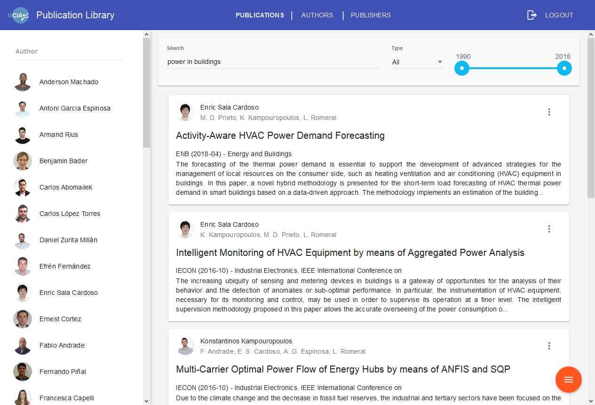

# publication-library

Web application for managing publications in a Research Center.

The following is a screenshot of the application:

## How it's made

The application consists of a web frontend module and a backend module.

The web frontend is implemented using:

 * AngularJS.
 * Material-AngularJS.
 * A bit of Bootstrap.
 * Webpack.

The backend is implemented using:

 * Spring Framework (Boot, Data, MVC, Security).
 * A bit of RxJava.
 * MongoDB.

## Contributing

Feedback or contributions are welcome!

Please create an issue to discuss it first :)
